# TIX - E-Ticketing Website

## Event Ticket Booking Management System

**Course Code:** CSE370  

---

## Overview

TIX is a web-based E-Ticketing platform designed to make event browsing, ticket booking, and event management simple and efficient. Users can register, log in, explore events, view event details, add tickets to cart, apply discount codes, load balance, and complete checkout. Admins can manage venues, events, discounts, and seat generation.

The system supports both customer and admin roles. Customers can browse events, review venues, manage tickets, and purchase tickets through a structured checkout process. Admins can add venues, create events, manage discounts, and control event-related data.

---

## Tech Stack

- **Frontend:** HTML, CSS, JavaScript, Laravel Blade
- **Backend:** PHP, Laravel
- **Database:** MySQL
- **Version Control:** Git and GitHub

---

## Features

- User registration and login system
- Logout functionality
- Role-based access for Admin and Customer
- Browse events such as movies, concerts, conferences, and festivals
- Search and filter events by category, date, or venue
- View detailed event information
- Seat selection and availability checking
- Ticket booking functionality
- Multiple ticket booking support
- Add event tickets to cart
- Secure payment processing
- Load user balance
- Apply discount and coupon codes
- Checkout and booking confirmation
- Booking history for users
- User profile management
- Review system for events and venues
- Admin can add venues
- Admin can add events
- Admin can add discount codes
- Admin can generate seats for events

---

## Feature Matrix

| Sl | Feature Name | Type | Notes |
|---|---|---|---|
| 1 | User Registration and Login | Create, Read | Users can create an account and log in securely |
| 2 | Logout | Read | Ends the user session safely |
| 3 | Role-Based Access | Read | Separates Admin and Customer functionalities |
| 4 | Browse Events | Read | Customers can view available events |
| 5 | Search and Filter Events | Read | Events can be filtered by category, date, or venue |
| 6 | Event Details | Read | Shows event image, date, venue, description, ticket price, and availability |
| 7 | Admin Venue Management | Create, Read, Update, Delete | Admin can add and manage venue information |
| 8 | Admin Event Management | Create, Read, Update, Delete | Admin can add and manage events |
| 9 | Discount Management | Create, Read | Admin can create coupon codes with discount percentage and expiry date |
| 10 | Seat Generation | Create | Admin can generate seats for events |
| 11 | Add to Cart | Create, Update | Customers can add selected tickets to cart |
| 12 | Load Balance | Update | Customers can add balance to their account |
| 13 | Apply Discount | Update | Coupon discount is applied during payment |
| 14 | Checkout | Create | Booking is confirmed after payment |
| 15 | Booking History | Read | Customers can view previous bookings |
| 16 | Feedback Section | Create, Read | Customers can submit ratings and reviews |

---

## Admin Perspective

| Sl | Feature | Notes |
|---|---|---|
| 1 | Admin Dashboard | Admin can access Venue, Event, and Discount management sections |
| 2 | Add Venue | Admin can add venue name, location, and capacity |
| 3 | Add Event | Admin can add event name, date, time, venue, category, and description |
| 4 | Add Discount | Admin can create coupon codes, discount percentage, and expiry date |
| 5 | Seat Generation | Admin can generate seats for selected events |
| 6 | Existing Events | Admin can view already created events |

---

## Customer Perspective

| Sl | Feature | Notes |
|---|---|---|
| 1 | Explore Events | Customer can browse available events |
| 2 | Event Details | Customer can view event details before booking |
| 3 | Add to Cart | Customer can select ticket quantity and add tickets to cart |
| 4 | Review Venues | Customer can browse venues and submit reviews |
| 5 | Load Balance | Customer can add balance for ticket purchase |
| 6 | Apply Discount | Customer can use coupon codes during checkout |
| 7 | Checkout | Customer can confirm ticket purchase |
| 8 | My Tickets | Customer can view purchased tickets |

---

## Screenshots

### Home Page
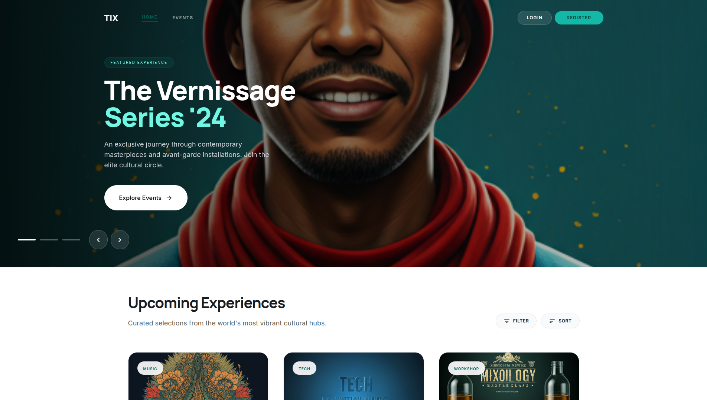

### Registration Page
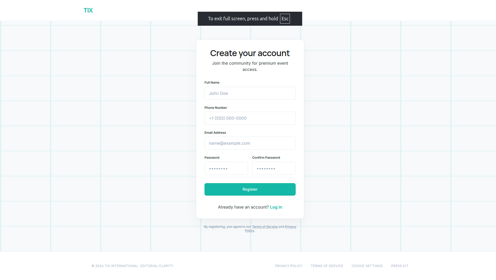

### Admin Dashboard
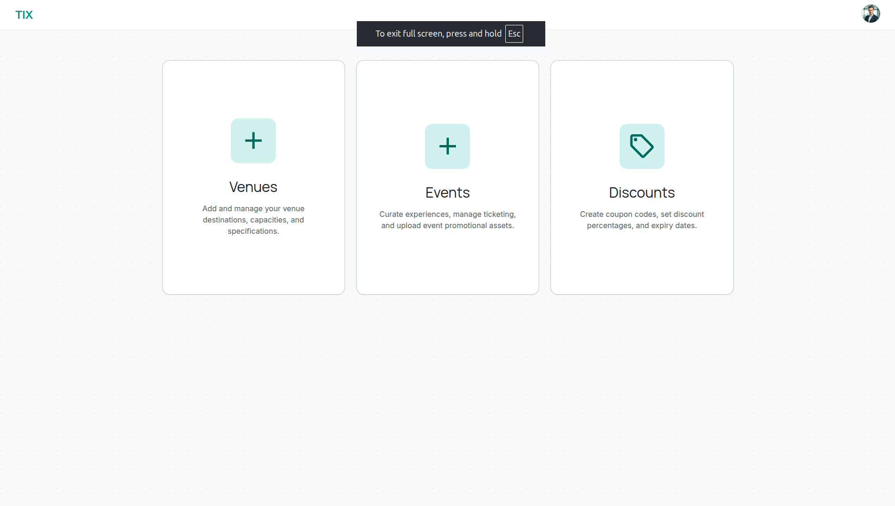

### Add Event
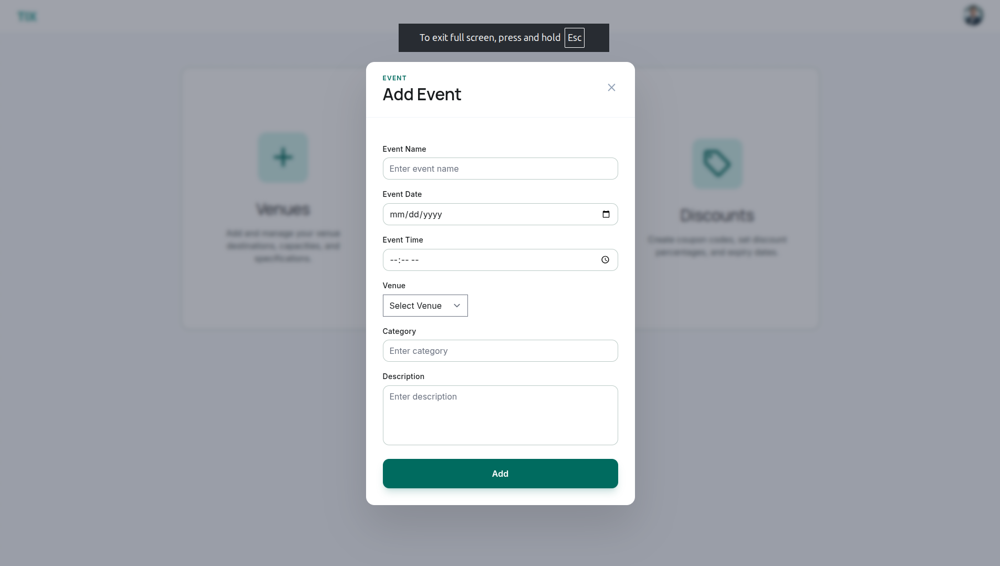

### Add Discount
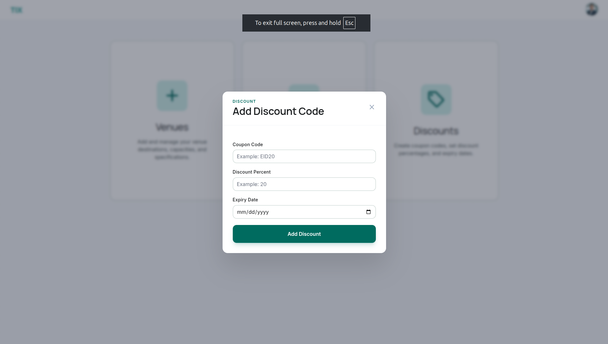

### Explore Events
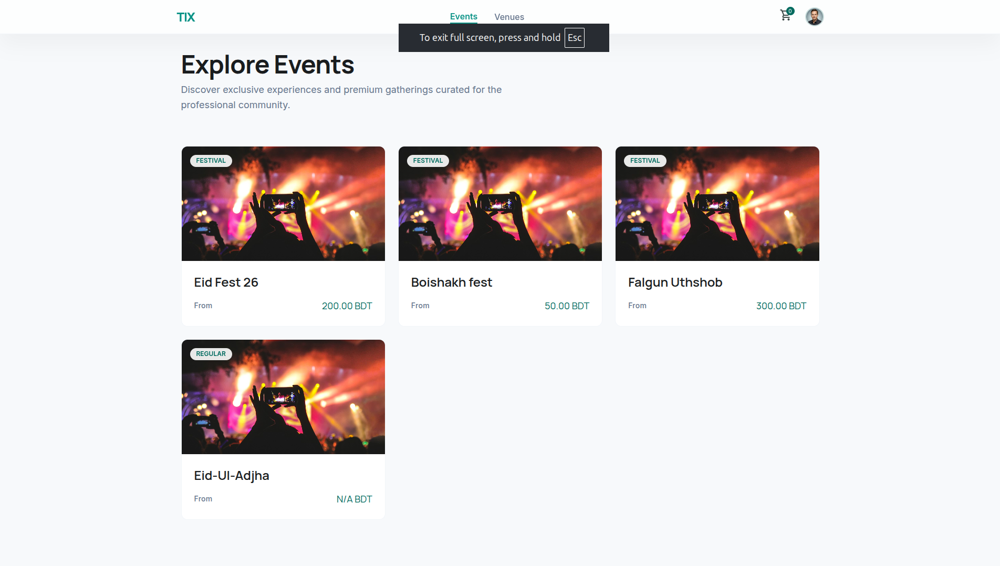

### Event Details
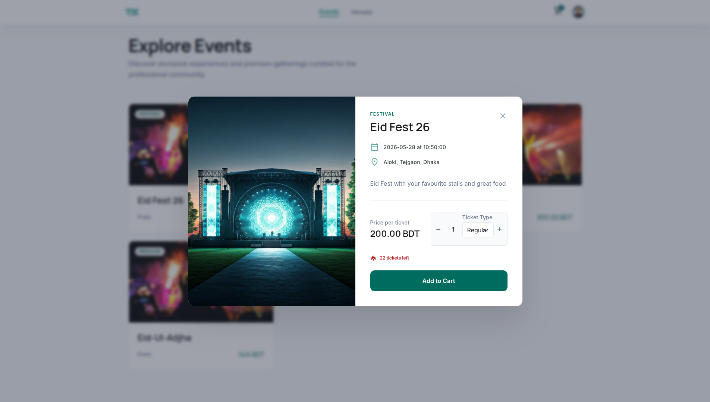

### Review Venues
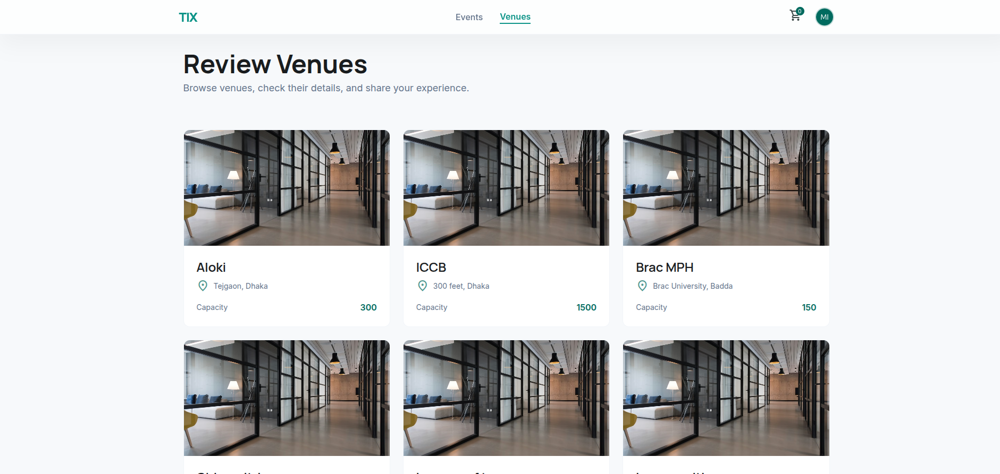

### Venue Review Modal
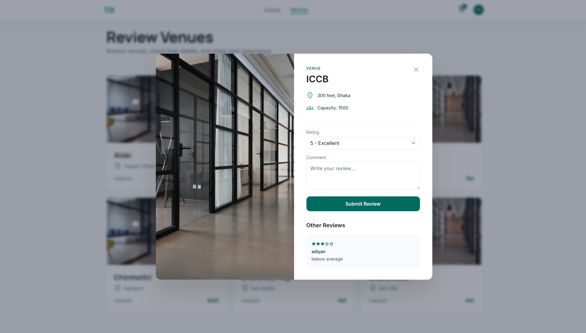

### Checkout Page
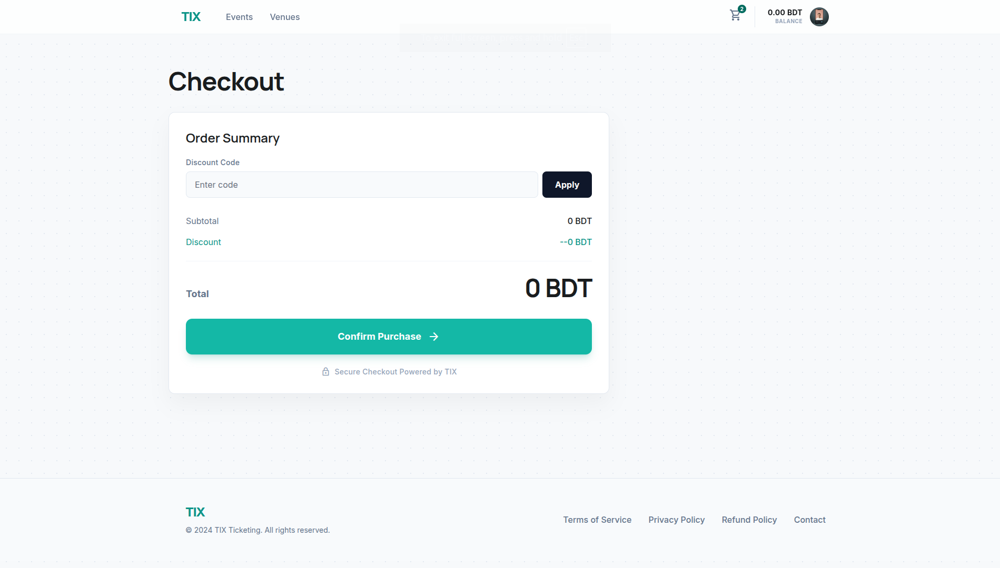

### Load Balance
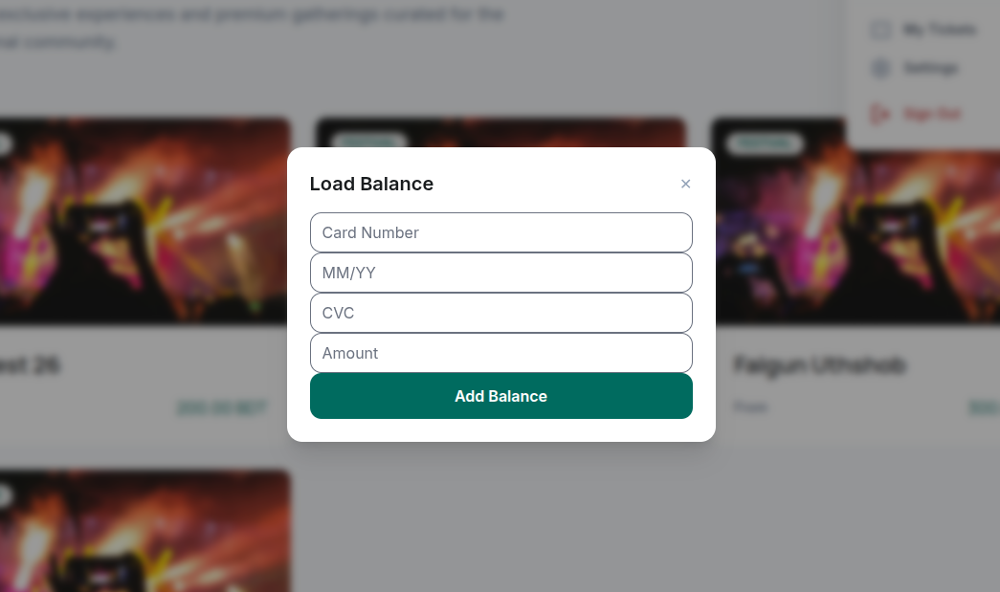

---

## 🔗 Repository

GitHub Repository:  
https://github.com/alvibinmobarok/eticket-dbms-project.git

---

## 📌 Conclusion

TIX E-Ticketing Website provides a simple and efficient platform for users to browse events, view event details, select tickets, apply discounts, and complete bookings through a structured checkout process. The system supports both customer and admin roles, allowing customers to manage their tickets and balance while admins can manage venues, events, discounts, and seat generation.

By using PHP, MySQL, HTML, CSS, JavaScript, and Laravel Blade, the project combines frontend usability with backend database functionality. Overall, this project demonstrates how a database-driven web application can make event ticket booking more organized, secure, and user-friendly.
